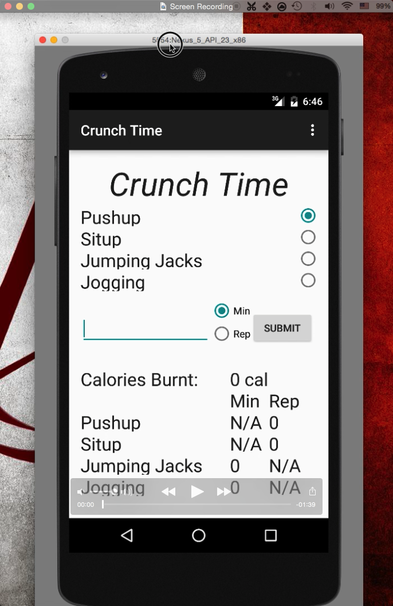
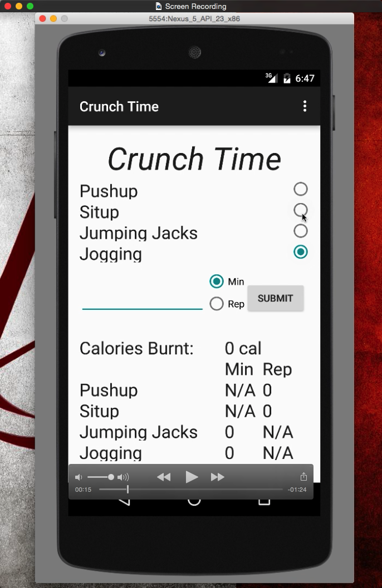
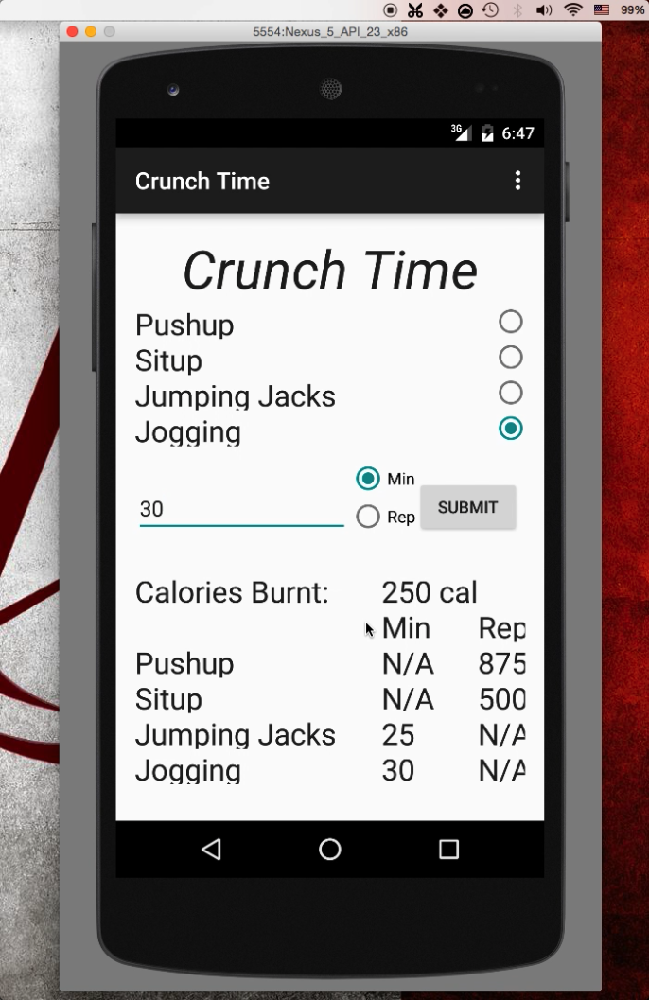

# PROG 01: Crunch Time

The app would allow users to enter the type of exercise and how many reps/minutes they did. The user should see how many calories they have burned. Also it could allow a user to enter the type of exercise and how many reps/minutes they did. The user should also see the equivalent amount of minutes/reps for any other exercise needed to burn an equivalent amount of calories.

## Authors

Qingyu Wang ([qywang@berkeley.edu](mailto:qywang@berkeley.edu))

## Demo Video

See [Crunch Time] (https://www.youtube.com/watch?v=9ocG9IZ-_lQ)

## Screenshots

